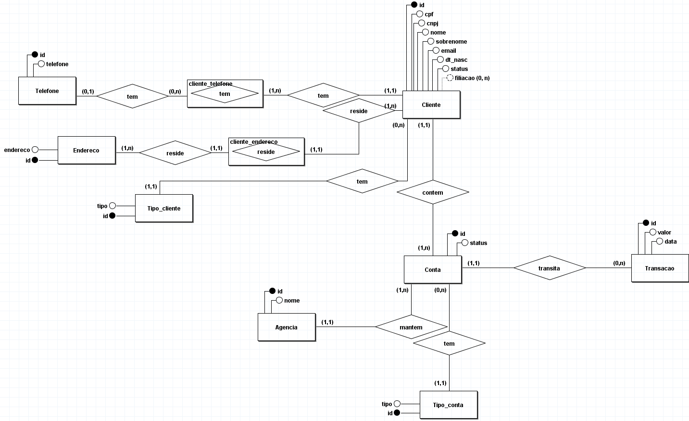
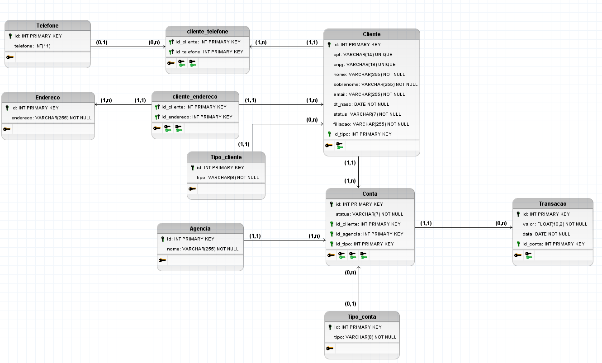

# Projeto Banco de Dados

*Este projeto tem o objetivo de praticar os conhecimentos sobre **Banco de Dados**.* Como um projeto final, é uma síntese de grande parte do conhecimento adquirido durante os 3 meses do curso de Administrador de Banco de Dados pelo SENAI Taguatinga. Para isso, o projeto se trata sobre um cenário em que uma fintech precisa de um banco de dados (db_fintech) para gerir o seu negócio, dentro das especificações apresentadas.

# Sobre a proposta de projeto
*A proposta de projeto tem o seguinte enunciado:* 

## Projeto DBA QUA 070.084

Você foi contrato para desenvolver um banco de dados para uma nova fintech. Seu banco deve ser capaz de armazenar, dados de usaurios, tais como ,nome, sobrenome, endereço, telefone, filiação
email, data de nascimento, cpf.
Os clientes poderão ser fisicos ou juridicos, no caso de pessoas fisicas poderão ter conta corrente ou poupança, ja cliente juridico deve ter apenas contas correntes para as contas é nessecario saber o numero, agencia e o tipo. Cada cliente devera ter suas movimentações financeiras armazenadas, para assim poder contabilizar seu saldo, todo novo cliente caso não inicie com uma aplicação ficnanceira deve ser inserido com saldo zero.
Cada cliente deve ter um status de ativo ou inativo assim como também as contas devem conter o mesmo status.

Cada cliente podera ter apenas uma conta corrente e uma poupança, contas correntes e contas poupças devem ser vinculadas a um unico cliente. Enderecos podem ser atribuidos a mais de um cliente, assim como o telefone, um cliente também pode ter mais de um telefone.
- Moidelo conceitual
- modelo logico
- modelo fisico
- nenhuma string deve ser minuscula, todas devem estar em maiuscula e sem acento
- procedimento de insert, delete, update para todas as tabelas validando todos os dados possiveis.
- caso necessario desenvola pelo menos uma trigger
- crie pelo menos uma função caso necessário.
- documento todo o seu projeto em arquivo markdown
    - crie na pasto projeto, uma nova pasta chamada scripts
    - na pasta scripts coloque em arquivos separados
    - CREATE DATABASE e TABLES
    - INSERT.sql
    - ROUTINES.sql
    - VIEWS.sql
    - TRIGGERS.sql
    - DUMP completa do banco
### DESCREVENDO AS VIEWS
- crie uma view que mostre todos os dados pessoais dos cliente (nome, endereco, telefone e etc), identificado quais são juricos e quais são fisicos
- crie uma view que mostre o nome, cpf do cliente e todas as suas trasações financeiras.

# Modelo Conceitual

# Modelo Lógico

# Modelo Físico

## Tabelas do banco
Em ordem de cadastro no banco, as tabelas são as seguintes:
- tb_cliente_juridico;
- tb_endereco;
- tb_tipo_conta;
- tb_tipo_transacao;
- tb_tipo_telefone;
- tb_cliente_fisico;
- tb_telefone;
- tb_cliente_telefone (sendo essa, na verdade, uma tabela associativa);
- tb_conta;
- tb_transacao

## Rotinas
Foram criados três procedimentos para cada tabela, exceto na associativa que teve apenas dois. Esses procedimentos foram criados para usar os três comandos de DML (INSERT, DELETE e UPDATE) de forma que os dados fossem manipulados especificamente para as condições do banco. Uma função foi criada para manipular strings: ela deixa o texto com letras maiúsculas e, depois disso, retira acentos das letras e substitui 'Ç' por 'C'.

## Inserção de dados
Os dados são inseridos por um procedimento de INSERT criado para a sua tabela específica.

## Triggers
Foram criadas seis gatilhos no total:
- Trigger para verificar se o cliente físico já tem um conta corrente e/ou uma poupança;
- Trigger para alterar saldos das contas;
- Trigger para barrar cadastro de um endereço de um cliente jurídico para um cliente físico;
- Trigger para barrar cadastro de um telefone de um cliente jurídico para um cliente físico;
- Triggers para deletar item de tb_cliente_telefone se nem o cliente nem o telefone existirem mais.

## Views
Como anteriormente dito, as views foram propostas da seguinte forma:
- *crie uma view que mostre todos os dados pessoais dos cliente (nome, endereco, telefone e etc), identificado quais são juricos e quais são fisicos*
- *crie uma view que mostre o nome, cpf do cliente e todas as suas trasações financeiras.*

# Redes sociais e formas de contato

